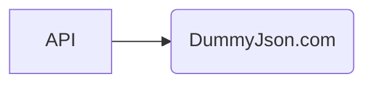
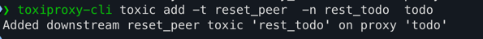
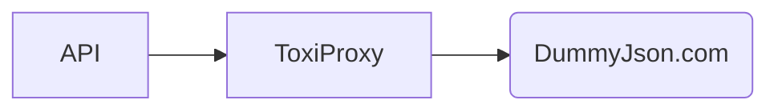

## API Setup



Toxiproxy is a framework for simulating network conditions.

## Installing ToxiProxy

https://github.com/Shopify/toxiproxy?tab=readme-ov-file#1-installing-toxiproxy

## Steps to simulate network conditions
### start the server
```shell
toxiproxy-server
```


### Create a proxy
```shell
toxiproxy-cli create -l localhost:8444 -u dummyjson.com:443 todo
```


### List proxies
```shell
toxiproxy-cli list
```


### Inject latency

```shell
toxiproxy-cli toxic add -t latency -a latency=6000 todo
```


### Check latency
Now hit the URL with Postman
```shell
curl --location 'https://localhost:8443/todos/1' \
--header 'host: dummyjson.com'
```
### Simulate connection reset

```shell
toxiproxy-cli toxic add -t reset_peer  -n rest_todo  todo
```


### Inspect all toxics for a proxy
```shell
curl --location 'http://localhost:8474/proxies/todo'
```
response with something like below
```json
{
    "name": "todo",
    "listen": "127.0.0.1:8443",
    "upstream": "dummyjson.com:443",
    "enabled": true,
    "Logger": {},
    "toxics": [
        {
            "attributes": {
                "latency": 6000,
                "jitter": 0
            },
            "name": "latency_downstream",
            "type": "latency",
            "stream": "downstream",
            "toxicity": 1
        }
    ]
}
```

## API Setup with Proxy


## Load testing

### Remove Proxy to start with

```shell
toxiproxy-cli toxic remove -n latency_downstream todo
```
### cd to Api folder
```shell
cd ApiUsingToxiProxy/
```
### Run Load tests
```shell
k6 run --vus 2 --duration 60s --rps 2 ./loadtest.js
```
### Add Latency
Add latency to the proxy after load test has started
```shell
toxiproxy-cli toxic add -t latency -a latency=6000 todo
```
After a few timeouts you will see circuit breaker open
### Remove Latency
Remove latency to the proxy after sometime
```shell
toxiproxy-cli toxic remove -n latency_downstream todo
```
circuit breaker should be closed
http status code should be 200 after the circuit breaker is closed

